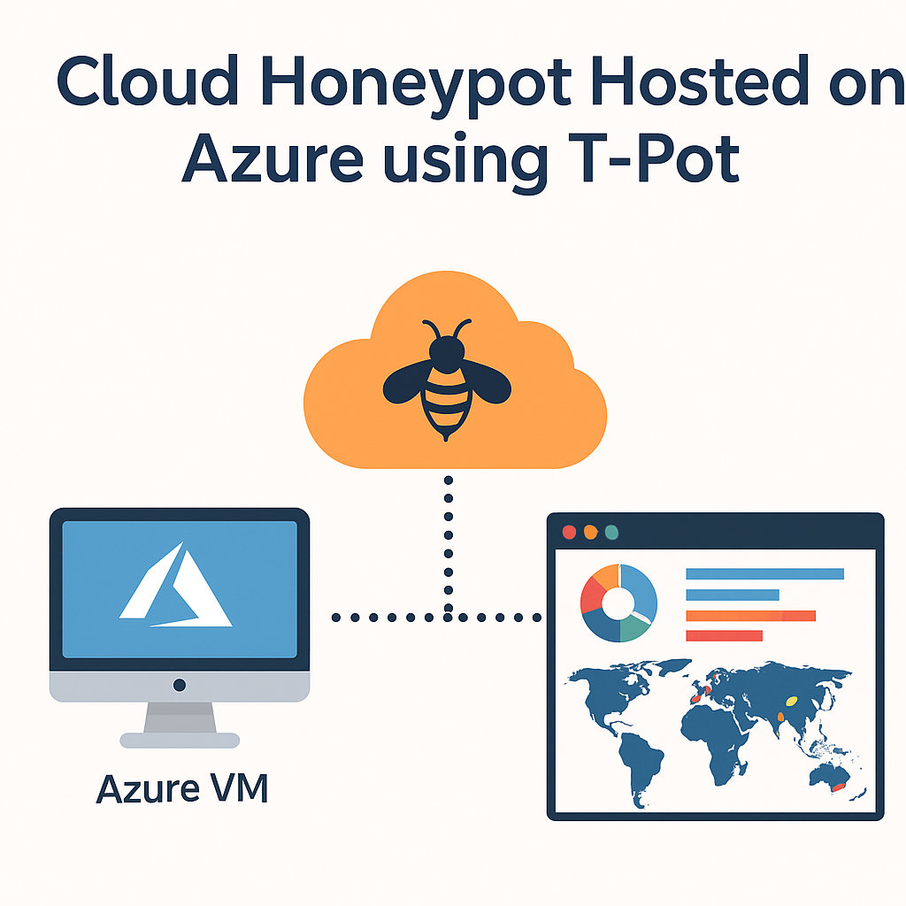

# ☁️ Cloud Honeypot on Azure using T-Pot

This project documents the deployment of a **cloud-based honeypot environment** using **T-Pot** on an **Azure Virtual Machine**. The goal was to monitor and analyze real-world cyberattacks by collecting logs and traffic data from a variety of honeypot services.

---

##  Folder Structure

```
azure-cloud-honeypot-tpot/
├── screenshots/                  # Screenshots of dashboards and attack data
│
├── INSTALLATION.md              # Step-by-step guide to set up the honeypot on Azure
├── README.md                    # Project overview, goals, and explanation
├── architecture-diagram.png     # Architecture diagram of the cloud honeypot setup

```

---

##  Tools Used

- **Microsoft Azure** – Cloud platform to host the honeypot VM
- **T-Pot Honeypot Framework** – Integrated honeypot platform with multiple sensors
- **Ubuntu Server** – Base OS for the VM
- **Azure NSG** – To control inbound and outbound network traffic

---

##  Architecture Diagram



---

##  Setup Guide

Check the [INSTALLATION.md](INSTALLATION.md) file for the full deployment steps including:

- Azure VM provisioning
- Opening ports via NSG (Network Security Group)
- Downloading and installing T-Pot
- Initial setup and configuration
- Accessing dashboards

---

##  Result

Once deployed, the honeypot captured real-world malicious traffic, such as:

- SSH and RDP brute-force attacks
- Port scans
- Web exploit attempts

The T-Pot web UI provided dashboards to visualize logs, source geolocations, and attack trends in real time.

---

##  Screenshots

Find detailed screenshots in the [screenshots/](screenshots/) folder, including:

- T-Pot dashboard
- Attack visualizations
- Open ports settings
- Azure VM setup

---

##  Project Outcome

-  Learned about honeypot deployment and network security monitoring
-  Gained hands-on experience in Azure VM setup and port configurations
-  Understood how attackers scan and target vulnerable systems

---

##  References

- [T-Pot GitHub Repository](https://github.com/telekom-security/tpotce)
- [Microsoft Azure Documentation](https://learn.microsoft.com/en-us/azure/)